# 動態表單

## 📌 使用架構
- .net core + vue2/3

## 📌 功能介紹
給予管理者設定動態表單, 並給予多個模組做共用, 設定後可於前台顯示畫面收集使用者表單資訊
- 後台畫面
  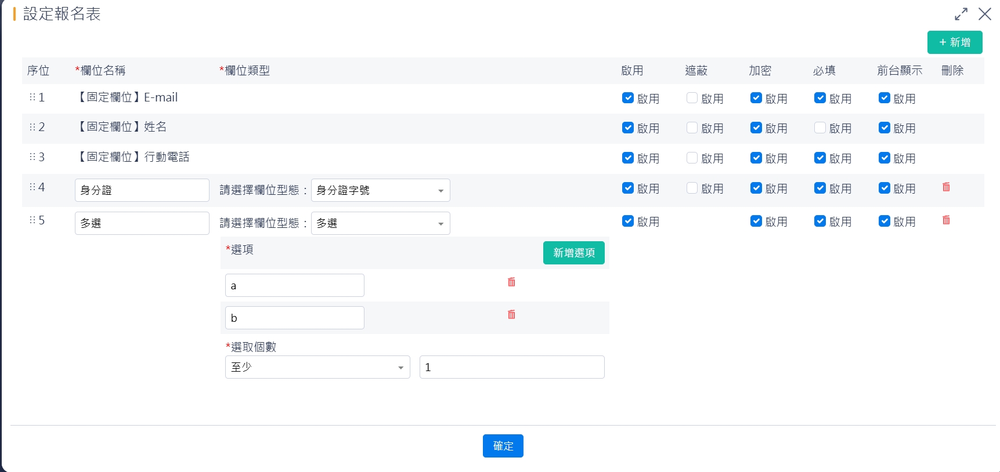
- 前台畫面
  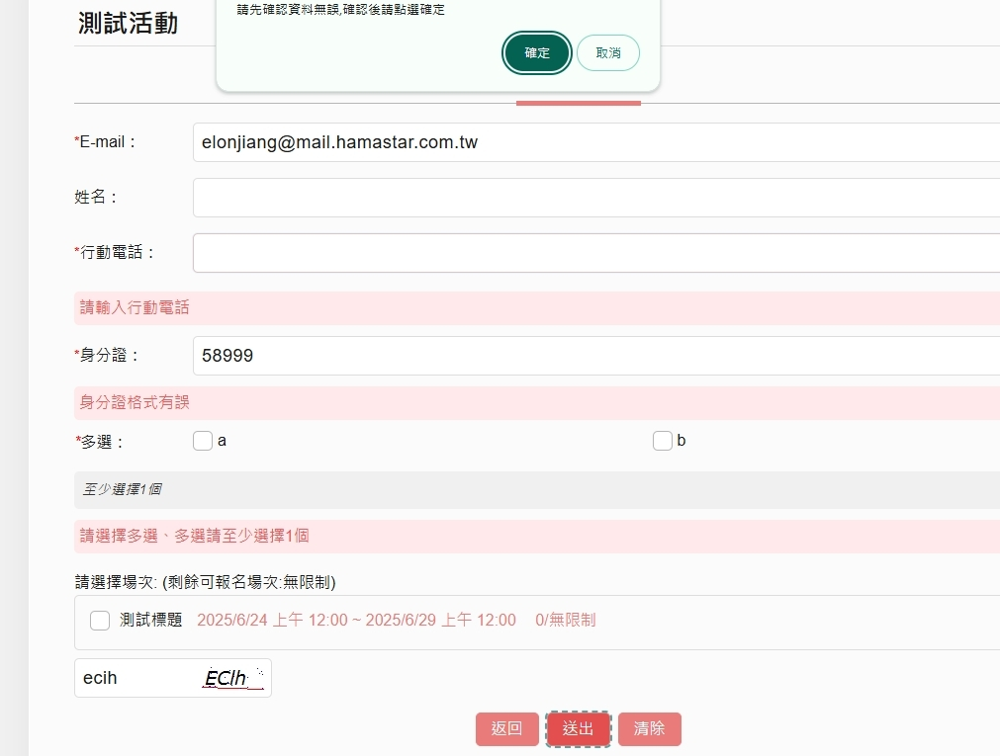

---
## 🏗 **後臺架構**

- 設計大綱
  
  動態表單, 分為兩種動態欄位類型, ("固定欄位", "非固定欄位"),  所以主軸會以這兩種類型去設計

## **🔹 `Index.cshtml`**

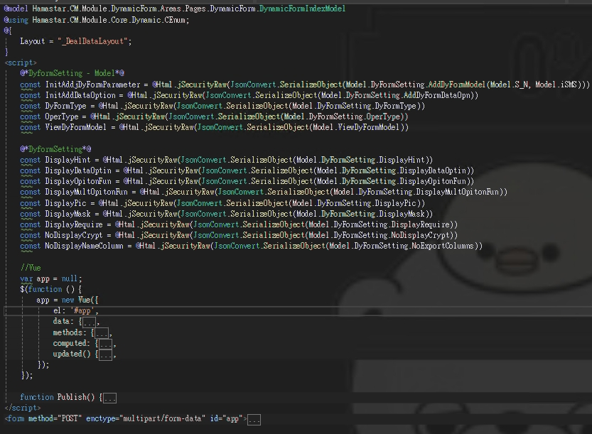

## **🔹 `Index.cs`**
## 🛠️ 固定欄位(系統預設會直接自己寫入, 非管理者新增)

.jpg)

- 先設定有什麼固定欄位

  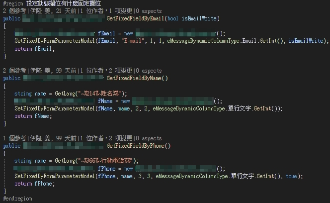

- 將固定欄位包成群組

  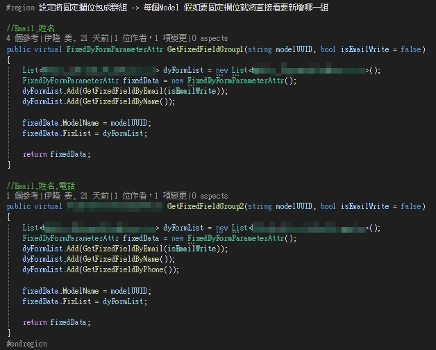

- 設定每個呼叫的模組該叫用哪個固定欄位群組

  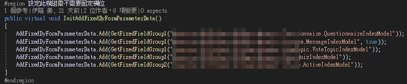

- 根據呼叫表單的模組, 判斷該預設哪個固定欄位組

  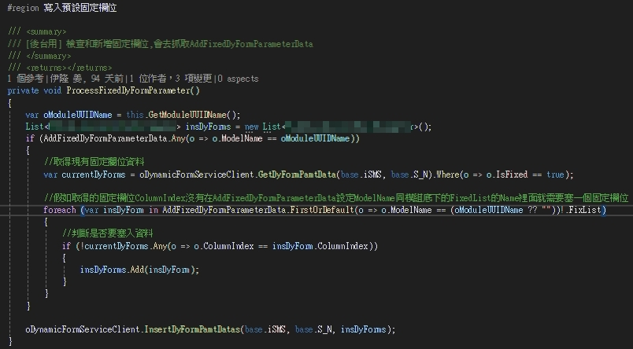
  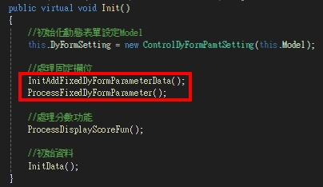

  ## 💡 設計理念
  ** 基本上沒有其他固定欄位的群組需求, 未來模組叫用只需override AddFixedDyFormParameterData **
  
  
## 🛠️ 非固定欄位(系統會根據ControlDyFormPamtSetting 來做功能的設定與畫面顯示)

.jpg)

- 設定新增的每一行動態表單的預設Model

  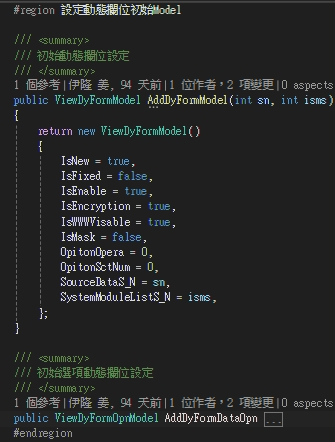

- 控制要顯示什麼功能或欄位

  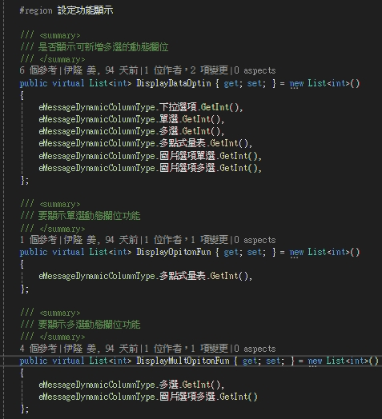

  ## 💡 設計理念
  ** 是為了讓顯示畫面, 不可列印欄位, 統計欄位等..簡化設定方式, 以提高維護性, 前台也會依需求抓取這邊的設定做判斷 **

## 🛠️ 動態表單存檔

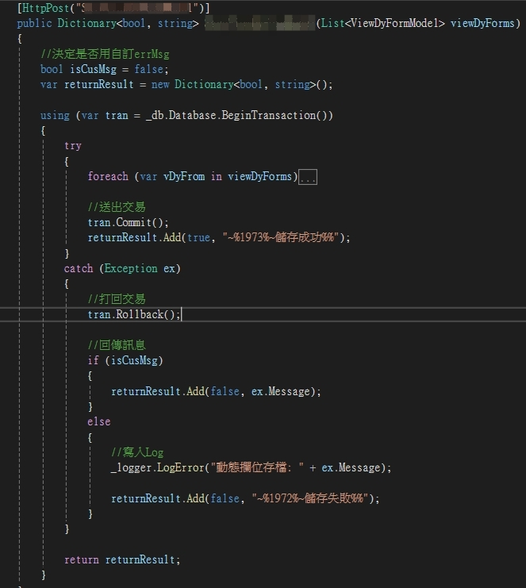
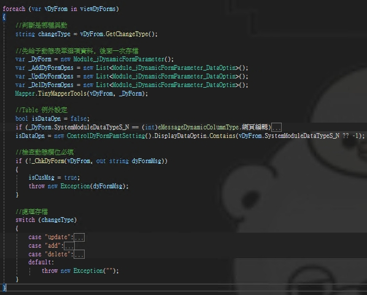

- 檢查動態表單(_ChkDyForm) & 動態表單選項(_ChkDyFormOpn)

  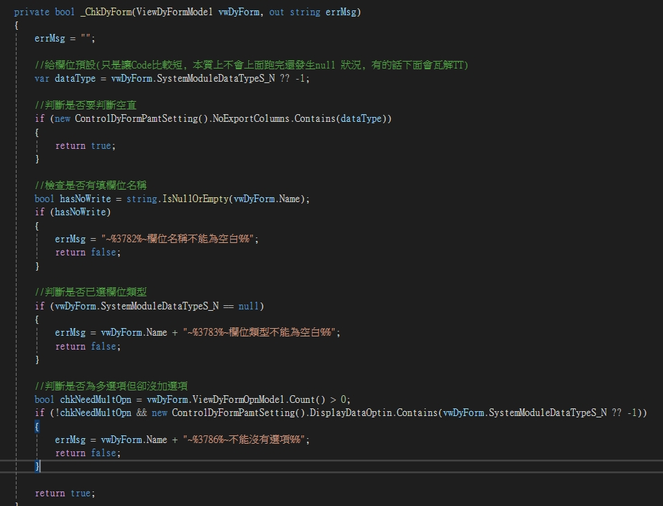
  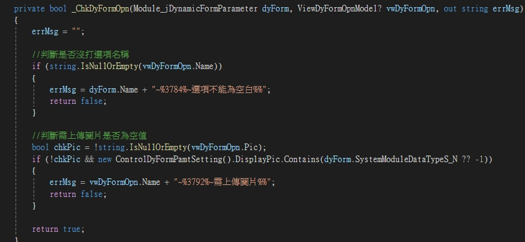


---
## 🏗 **前台架構**

- 設計大綱
  
  主軸設計成兩隻vue, 一隻vue 丟參數返回對應的動態欄位(VueComponetDetail), 另一隻則是存該模組設定的動態表單(VueComponet)

## **🔹 `VueComponet.cshtml & VueComponetDetail.cshtml`**

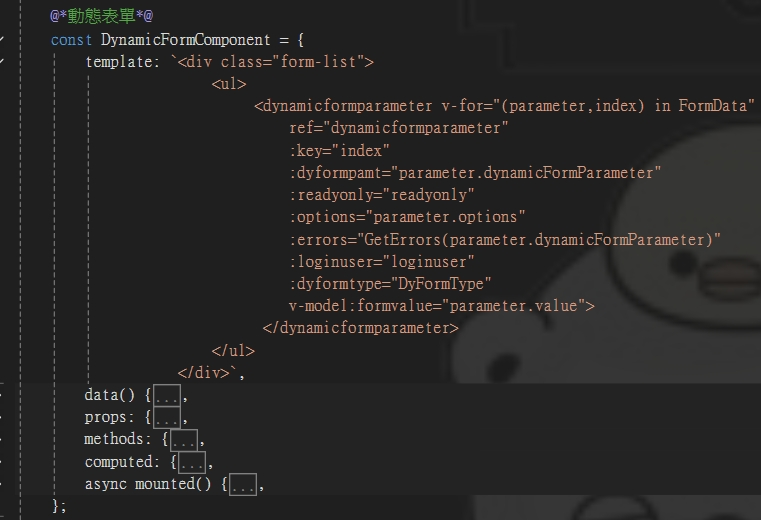
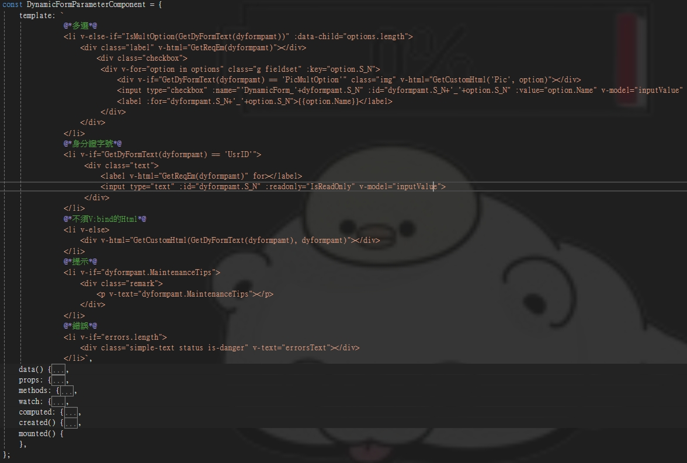

- 動態表單的Componet會再針對各叫用模組的通用功能, 會統一寫在這支, 提高維護性舉例(Alert, Confirm)

  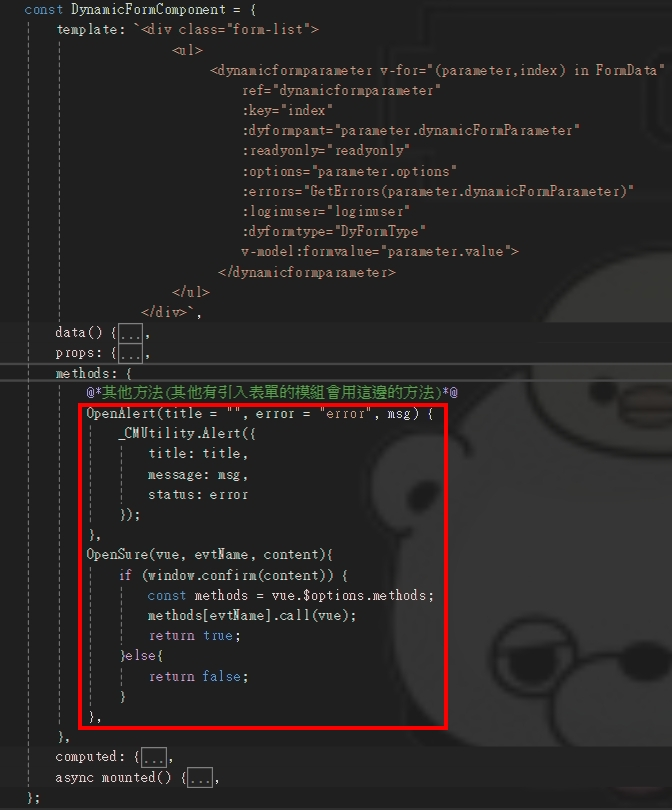

  ## 💡 設計理念
  ** 兩隻拆開寫, 主要提高可讀性, 可維護性以及減少重複寫同樣的code , 其他模組叫用嵌入componet 即可
  ```csharp
  <dynamicform ref="dyform" :s="s" :u="isUpdate" :dyno="dyno" :loginuser="LoginUser" :readyonly="true || false"></dynamicform>
  ```
  **

## **🔹 `DyFormAPI.cs`**
## 🛠️ 使用者送出表前檢查

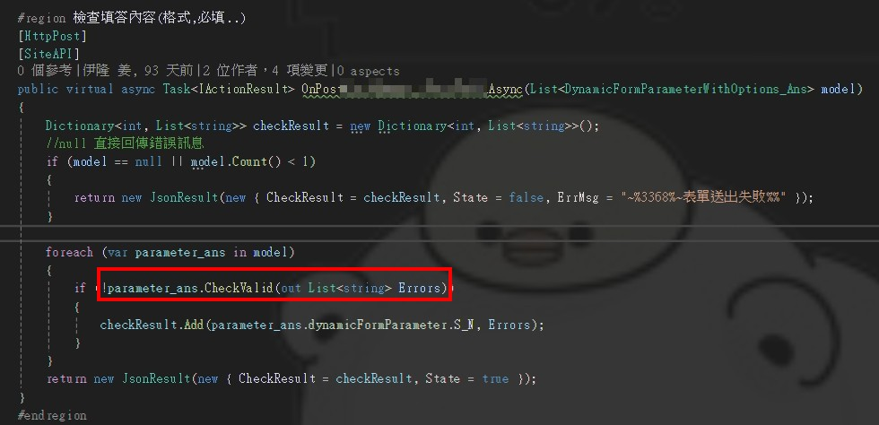
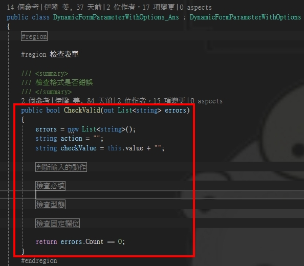

- 判斷輸入動作

  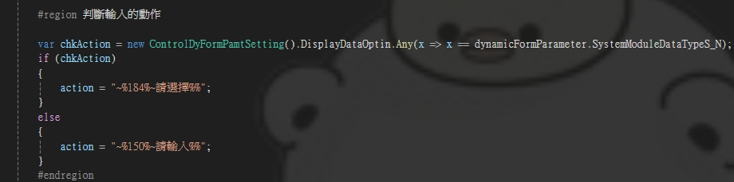

- 檢查型態

  

## 🛠️ 存檔動態表單

  

  - 新增資料

  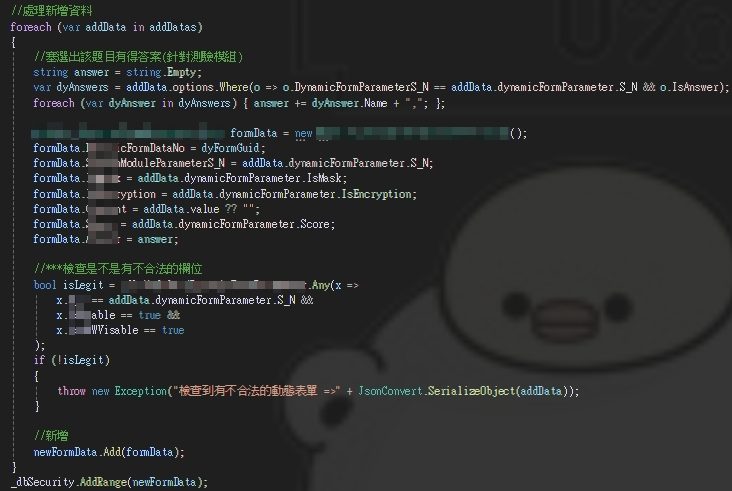

  - 修改資料

  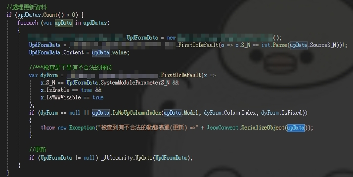
